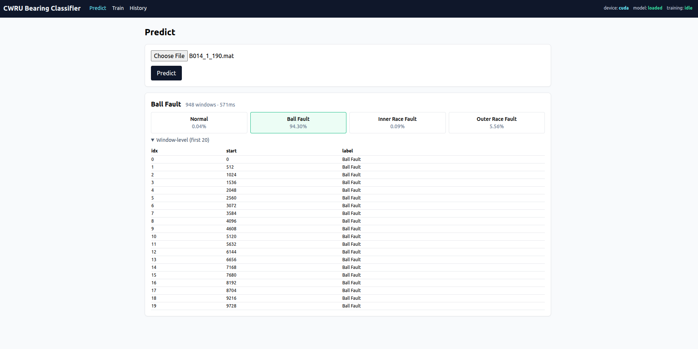

# CWRU Bearing Fault Classification

Case Western Reserve University(CWRU) 베어링 데이터셋을 사용한 베어링 결함 진단 시스템입니다.
PyTorch 기반 MLP 모델로 진동 신호를 분류하고, FastAPI 백엔드 + Vue 3 프론트엔드로 학습·추론·이력 관리를 웹에서 제공합니다.



> 자세한 설계는 [`docs/ARCHITECTURE.md`](docs/ARCHITECTURE.md), 클래스/시퀀스 다이어그램은 [`docs/UML.md`](docs/UML.md) 참고.

## 주요 기능

- **웹 기반 학습**: 하이퍼파라미터 입력 → 비동기 학습 → SSE로 실시간 손실/정확도 차트 갱신
- **웹 기반 추론**: `.mat` 파일 업로드 → 슬라이딩 윈도우 단위 추론 → 확률 평균 집계
- **모델 레지스트리**: 학습 결과를 자동 저장(`model.pt + scaler.joblib + meta.json`), 활성 모델 승격(promote) 지원
- **이력 관리**: 학습 런 / 모델 아티팩트 / 추론 로그를 SQLite에 영속화 후 조회

## 분류 대상 클래스

- **Normal** — 정상 상태
- **Ball Fault** — 볼 결함
- **Inner Race Fault (IR)** — 내륜 결함
- **Outer Race Fault (OR)** — 외륜 결함

## 기술 스택

| 영역 | 스택 |
|---|---|
| Backend | FastAPI, Uvicorn, SQLModel(SQLite), sse-starlette |
| ML / DSP | PyTorch, NumPy, SciPy, scikit-learn, joblib |
| Frontend | Vue 3, TypeScript, Pinia, Vue Router, Axios, Chart.js, Tailwind CSS |
| Build | Vite |

## 프로젝트 구조

```
cwru_bearing_classification/
├── backend/
│   ├── app/                     # FastAPI 애플리케이션
│   │   ├── main.py              # 앱 팩토리, lifespan
│   │   ├── db.py                # SQLModel 테이블
│   │   ├── api/                 # 라우터 (health, train, predict, models, inferences)
│   │   ├── services/            # TrainingService, InferenceService, GpuSlotManager, Broadcaster
│   │   └── schemas/             # Pydantic 입출력 스키마
│   ├── model.py                 # BearingClassifier (nn.Module)
│   ├── trainer.py               # 학습 루프 (Early Stopping, LR Scheduler)
│   ├── data_loader.py           # CWRUDataLoader (.mat 로딩, 슬라이딩 윈도우)
│   ├── dataset.py               # BearingDataset
│   ├── feature_extraction.py    # 시간/주파수 도메인 19차원 특징
│   ├── inference.py             # predict_signal (윈도우 단위 추론 + 집계)
│   ├── artifact.py              # ModelMeta, save/load
│   ├── config.py                # 전역 하이퍼파라미터
│   ├── data/                    # CWRU .mat 입력 파일
│   ├── models/                  # 저장된 아티팩트
│   ├── db/                      # SQLite 데이터베이스
│   └── requirements.txt
├── frontend/
│   ├── src/
│   │   ├── App.vue
│   │   ├── api/client.ts        # axios + 타입 정의
│   │   ├── router/
│   │   ├── stores/training.ts   # Pinia (SSE 연결 포함)
│   │   ├── views/               # PredictView, TrainView, HistoryView
│   │   └── components/MetricChart.vue
│   ├── vite.config.ts
│   └── package.json
└── docs/
    ├── ARCHITECTURE.md
    └── UML.md
```

## 설치 및 실행

### 사전 준비

- Python 3.10+
- Node.js 18.18.x
- (선택) CUDA 환경 — GPU 학습용

### 1) 백엔드

```bash
cd backend
python -m venv .venv
source .venv/bin/activate           # Windows: .venv\Scripts\activate
pip install -r requirements.txt

# 개발 서버 실행 (기본 포트 8000)
uvicorn app.main:app --reload --host 0.0.0.0 --port 8000
```

서버가 시작되면 `db/cwru.sqlite`가 자동 생성되고 `/api/health`로 헬스 체크가 가능합니다.

### 2) 프론트엔드

```bash
cd frontend
npm install
npm run dev          # 기본 포트 5173, /api는 백엔드로 프록시
```

브라우저에서 `http://localhost:5173` 접속.

### 3) 데이터 준비

CWRU 베어링 데이터셋의 `.mat` 파일을 `backend/data/` 디렉터리에 배치합니다.
파일명에 라벨 키워드가 포함되어 있어야 합니다 (예: `Normal_0.mat`, `Ball_007.mat`, `IR_007.mat`, `OR_007.mat`).

```
backend/data/
├── Normal_0.mat
├── Ball_007.mat
├── IR_007.mat
└── OR_007.mat
```

## 사용 흐름

1. **학습 (Train 탭)**
   - EPOCHS / BATCH_SIZE / LEARNING_RATE / DROPOUT 등 입력 → **Start**
   - 진행 중 SSE로 epoch별 손실·정확도 차트가 실시간 갱신
   - 종료 시 베스트 가중치가 자동으로 아티팩트로 저장되고, val_acc가 더 높으면 활성 모델로 자동 승격
2. **추론 (Predict 탭)**
   - `.mat` 파일 업로드 → 윈도우별 예측 + 확률 평균 집계 결과 표시
3. **이력 (History 탭)**
   - 학습 런 / 모델 아티팩트 / 추론 로그 조회
   - 다른 아티팩트를 선택해 활성 모델로 **Promote** 가능

## 모델 아키텍처

```
Input (19 features)
   ↓
Linear(128) → BatchNorm → ReLU → Dropout
   ↓
Linear(64)  → BatchNorm → ReLU → Dropout
   ↓
Linear(32)  → BatchNorm → ReLU → Dropout
   ↓
Linear(num_classes)
```

### 특징 벡터 (19차원)

**시간 도메인 (13)** — 평균, 표준편차, 최대, 최소, peak-to-peak, RMS, 절대 평균, 절대 최댓값, 파형 인자(shape factor), 임펄스 인자, 첨도(kurtosis), 왜도(skewness), 신호 에너지

**주파수 도메인 (6)** — FFT 평균 파워, 파워 표준편차, 최대 파워, 지배 주파수, 주파수 중심(centroid), 스펙트럼 엔트로피

## 추론 파이프라인

신호 → 슬라이딩 윈도우(기본 1024 샘플, overlap 0.5) → 윈도우별 19차원 특징 추출 → 학습 시 사용한 `StandardScaler` 적용 → 배치 추론 → 윈도우별 softmax 확률 평균 → 최종 라벨 결정

## API 엔드포인트

| Method | Path | 설명 |
|---|---|---|
| GET | `/api/health` | 헬스 체크 |
| POST | `/api/train/start` | 학습 시작 |
| POST | `/api/train/cancel` | 학습 취소 |
| GET | `/api/train/events` | SSE 학습 진행 스트림 |
| POST | `/api/predict` | `.mat` 업로드 후 추론 |
| GET | `/api/model/current` | 현재 활성 모델 |
| GET | `/api/models` | 모델 아티팩트 목록 |
| POST | `/api/models/{id}/promote` | 활성 모델 변경 |
| GET | `/api/inferences` | 추론 로그 조회 |

## 데이터 저장소

- **SQLite (`backend/db/cwru.sqlite`)**
  - `TrainingRun` — 학습 작업 메타 및 상태
  - `EpochMetric` — epoch 단위 손실/정확도/LR
  - `ModelArtifact` — 모델 레지스트리 (`is_current` 플래그)
  - `InferenceLog` — 추론 감사 로그
- **파일 시스템 (`backend/models/{artifact_id}/`)**
  - `model.pt`, `scaler.joblib`, `meta.json`

## 환경 변수

| 변수 | 기본값 | 설명 |
|---|---|---|
| `CWRU_DB_PATH` | `backend/db/cwru.sqlite` | SQLite 파일 경로 |
| `CWRU_DATA_DIR` | `backend/data` | CWRU `.mat` 디렉터리 |
| `CWRU_MODELS_DIR` | `backend/models` | 아티팩트 저장 디렉터리 |

> 실제 변수명은 `backend/config.py`를 기준으로 적용됩니다.

## 데이터셋 출처

- [Case Western Reserve University Bearing Data Center](https://engineering.case.edu/bearingdatacenter)
- 샘플링 레이트: 12,000 Hz, 윈도우 크기: 1,024 샘플

## 라이선스

본 프로젝트는 [LICENSE](LICENSE) 파일에 명시된 조건을 따릅니다.
