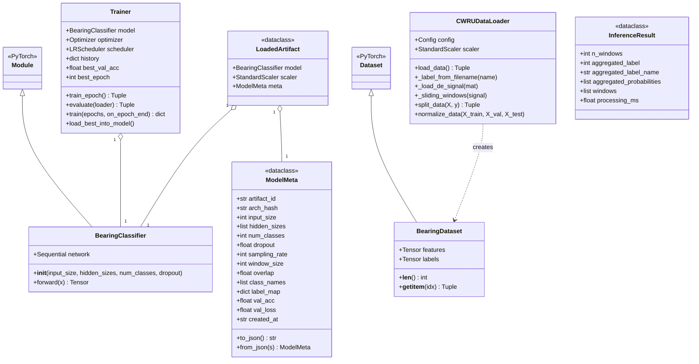
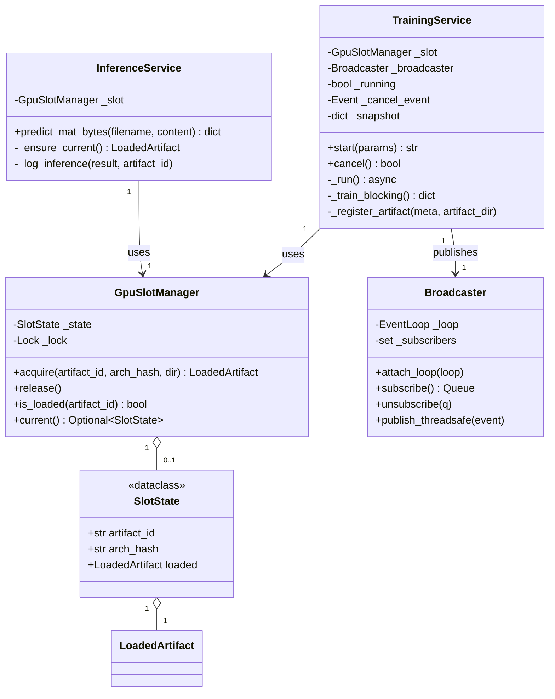
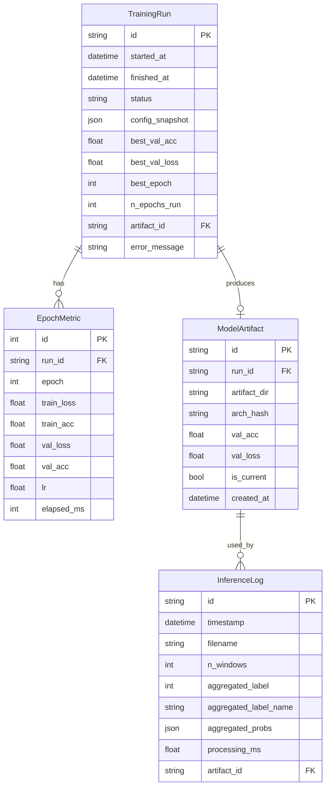
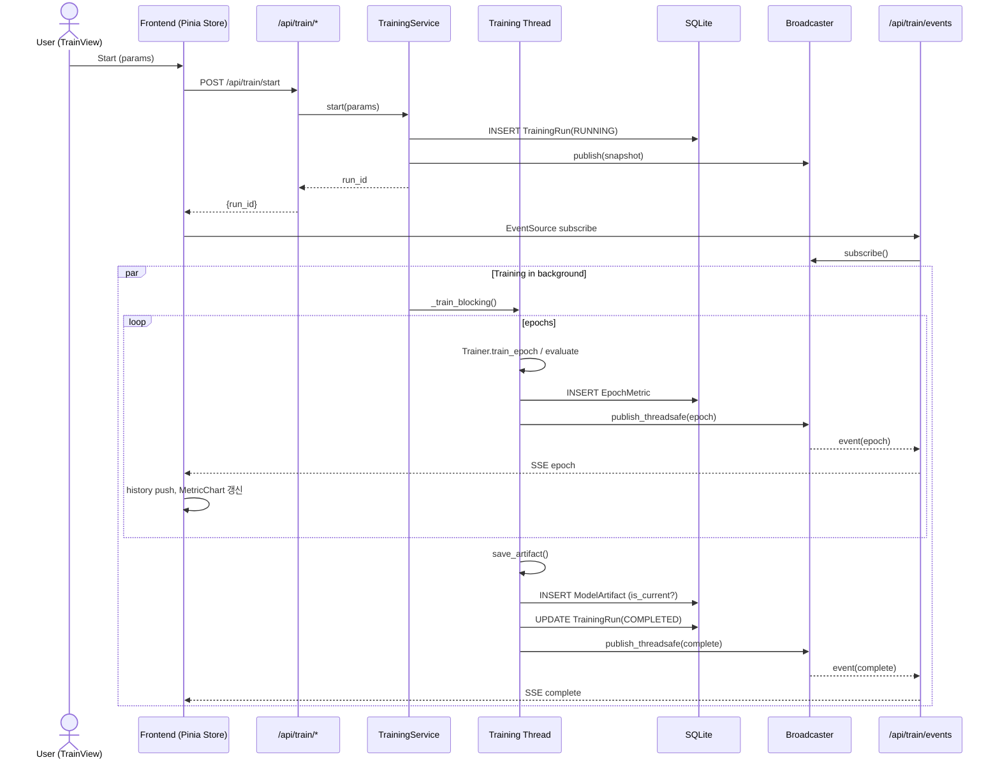
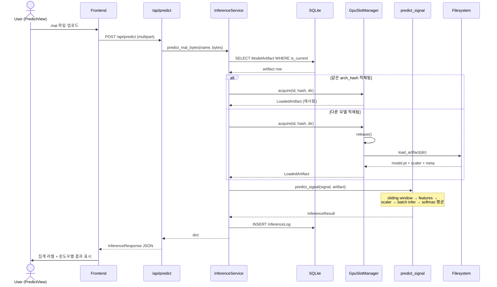
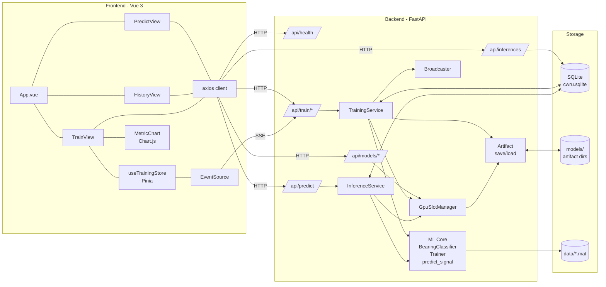
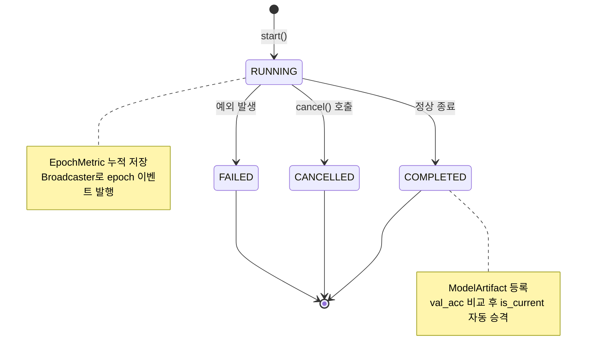
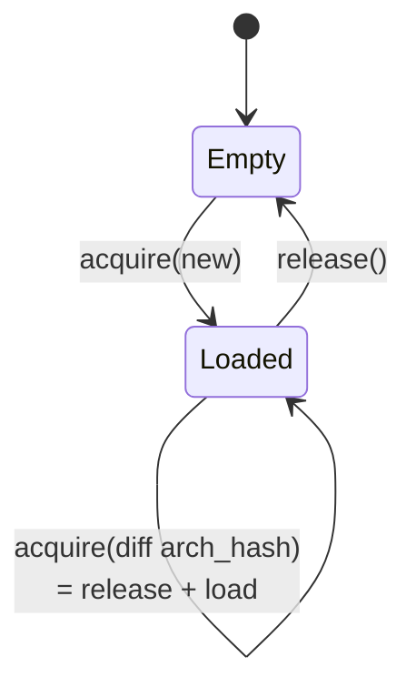

# CWRU Bearing Classification — UML 다이어그램

모든 다이어그램은 [Mermaid](https://mermaid.js.org/) 문법으로 작성되어 있어 GitHub 등에서 바로 렌더링됩니다.

---

## 1. Class Diagram — 백엔드 핵심 클래스

---

## 2. Class Diagram — 서비스 / 인프라 레이어

---

## 3. ER Diagram — 데이터베이스

---

## 4. Sequence Diagram — 학습 (Training Flow)

---

## 5. Sequence Diagram — 추론 (Prediction Flow)

---

## 6. Component Diagram — 시스템 전체

---

## 7. State Diagram — 학습 작업 상태

---

## 8. State Diagram — GPU 슬롯

---

## 9. 주요 파일 매핑

| 다이어그램 요소 | 소스 파일 | 라인 |
|---|---|---|
| BearingClassifier | `backend/model.py` | 12 |
| BearingDataset | `backend/dataset.py` | 11 |
| CWRUDataLoader | `backend/data_loader.py` | 21 |
| Trainer | `backend/trainer.py` | 22 |
| ModelMeta / LoadedArtifact | `backend/artifact.py` | 27 / 80 |
| InferenceResult | `backend/inference.py` | 32 |
| predict_signal | `backend/inference.py` | 48 |
| TrainingService | `backend/app/services/training.py` | 35 |
| InferenceService | `backend/app/services/inference_service.py` | 36 |
| GpuSlotManager | `backend/app/services/gpu_slot.py` | 28 |
| Broadcaster | `backend/app/services/broadcaster.py` | 15 |
| TrainingRun / EpochMetric / ModelArtifact / InferenceLog | `backend/app/db.py` | 38 / 52 / 64 / 75 |
| useTrainingStore | `frontend/src/stores/training.ts` | 8 |
| API client | `frontend/src/api/client.ts` | 3 |
